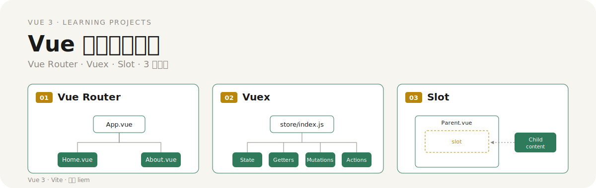
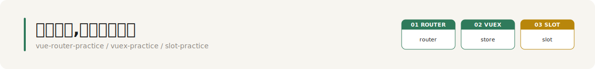

# Vue 学习项目合集



> Vue Router · Vuex · Slot — 用三个独立可运行的子项目,把 Vue 3 的路由、状态管理、插槽三大核心知识点各自练透。

---

## 三个子项目,三套真实文件



Hero 中的三栏结构图对应仓库里三个真实存在的练习目录。每个目录都是一个独立的 Vue 3 + Vite 工程,文件名即学习路径:

| 编号 | 子项目目录 | 技术栈 | 关键文件 | 练习主题 |
| --- | --- | --- | --- | --- |
| 01 | `vue-router-practice/` | Vue 3 + Vite + Vue Router | `router.js` · `Home.vue` · `About.vue` | 路由配置与页面跳转 |
| 02 | `vuex-practice/` | Vue 3 + Vite + Vuex | `store/index.js` | 集中式状态管理与组件间共享 |
| 03 | `slot-practice/` | Vue 3 | `Dparent.vue` · `Dslot.vue` · `CParent.vue` · `Cslot.vue` · `Cslot2.vue` | 默认插槽 / 具名插槽 / 作用域插槽 |

子项目 03 在仓库内对应 `插槽练习/` 目录,分为 `练习1/`(默认插槽)与 `练习2/`(具名插槽和作用域插槽),文件名与上表一一对应。

---

## 这是什么

一个把 Vue 3 三大核心机制拆成三个最小可运行工程的学习仓库。每个子项目只聚焦一个主题,不掺杂其他概念,方便逐个吃透。

---

## 为什么这样拆

Vue 3 的复杂度集中在三个彼此独立的机制上,混在一起学容易互相干扰:

- **Vue Router** — 解决"页面去哪"的问题。URL 与组件的映射、跳转、传参、嵌套,本质是一棵路由树。
- **Vuex** — 解决"数据在哪"的问题。State / Getters / Mutations / Actions / 模块化,本质是一棵单向数据流。
- **Slot** — 解决"内容怎么组合"的问题。默认插槽、具名插槽、作用域插槽,本质是组件的注入点与内容分发。

三个子项目分别对应这三棵"结构树",这也是 Hero 中三栏示意图的来源。

---

## 各练习原理简述

### 01 · Vue Router 路由练习

在 `router.js` 中声明 URL 到组件的映射,`App.vue` 提供 `<router-view>` 出口与 `<router-link>` 跳转入口,浏览器路径变化时由路由器决定渲染 `Home.vue` 还是 `About.vue`。结构上是一棵以 `App.vue` 为根、按路径分支的路由树。

### 02 · Vuex 状态管理练习

在 `store/index.js` 中集中存放共享状态。组件读取 State、通过 Getters 派生、用 Mutations 同步修改、用 Actions 处理异步,所有变更走单一入口,跨组件共享数据不再靠 props 逐层传递。结构上是一棵以 Store 为根、分出四个职责子节点的状态树。

### 03 · Slot 插槽练习

- **练习 1(默认插槽)**:`Dparent.vue` 在模板里留出 `<slot>` 占位,`Dslot.vue` 把内容塞进去,实现"父组件决定子组件内部展示什么"。
- **练习 2(具名插槽 + 作用域插槽)**:`CParent.vue` 用 `v-slot:name` 指定多个具名占位,`Cslot.vue` / `Cslot2.vue` 分别填充;作用域插槽则让子组件把数据回传给父组件决定渲染。结构上是 Parent 包裹 slot 占位、Child 内容通过虚线注入的嵌套关系。

---

## 如何运行

每个子项目都是独立工程,互不依赖。任选其一进入目录安装依赖即可:

```bash
# 进入某个子项目(以 vue-router-practice 为例)
cd vue-router-practice

# 安装依赖
npm install

# 启动开发服务器(默认 http://localhost:5173)
npm run dev

# 生产构建
npm run build
```

其余两个子项目把 `vue-router-practice` 替换为 `vuex-practice` 或 `slot-practice` 即可。

---

## 学习要点速查

### Vue Router

- 路由配置:`createRouter` + `routes` 数组
- 声明式跳转:`<router-link :to="...">`
- 编程式跳转:`router.push` / `router.replace`
- 动态路由:`:pathParam` 与 `useRoute` 取参
- 嵌套路由:`children` 配置 + 子 `<router-view>`
- 编程式导航守卫与重定向

### Vuex

- **State** — 唯一数据源
- **Getters** — 派生状态,类似计算属性
- **Mutations** — 同步变更,唯一允许改 State 的入口
- **Actions** — 异步操作,提交 Mutation
- **Modules** — 大型项目按模块拆分 Store

### Slot

- **默认插槽** — 单一内容分发点
- **具名插槽** — `v-slot:name` 多占位
- **作用域插槽** — 子组件向父组件回传数据
- **后备内容** — `<slot>` 内的默认值,父组件未传入时显示

---

作者:**liem** · 技术栈:Vue 3 + Vite · 用途:学习练习
